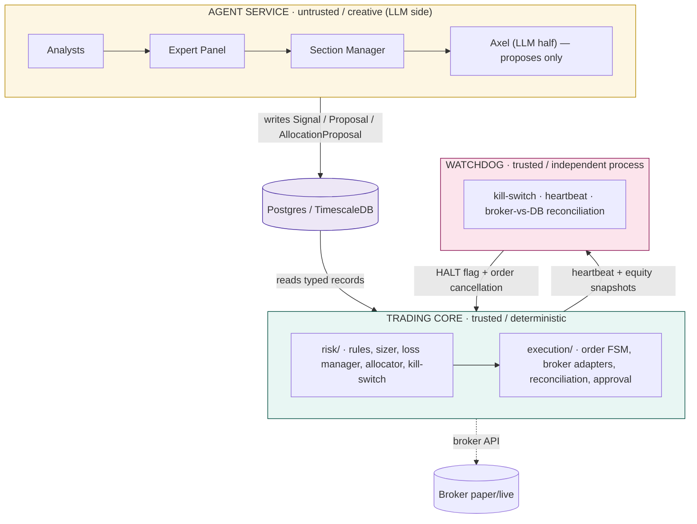
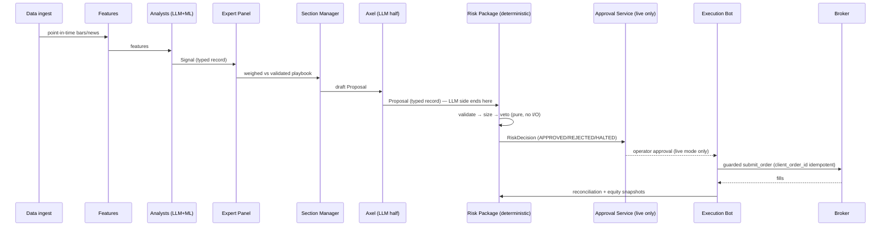
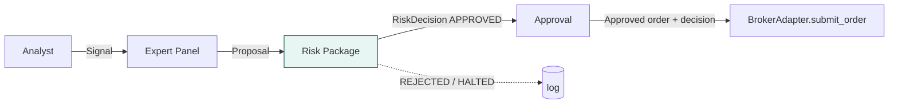
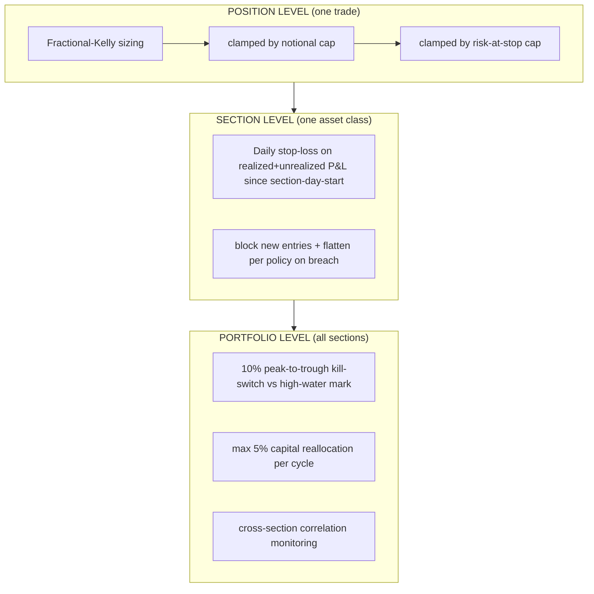
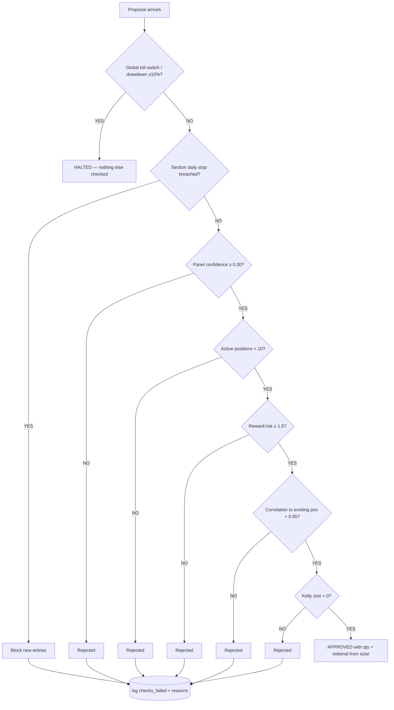
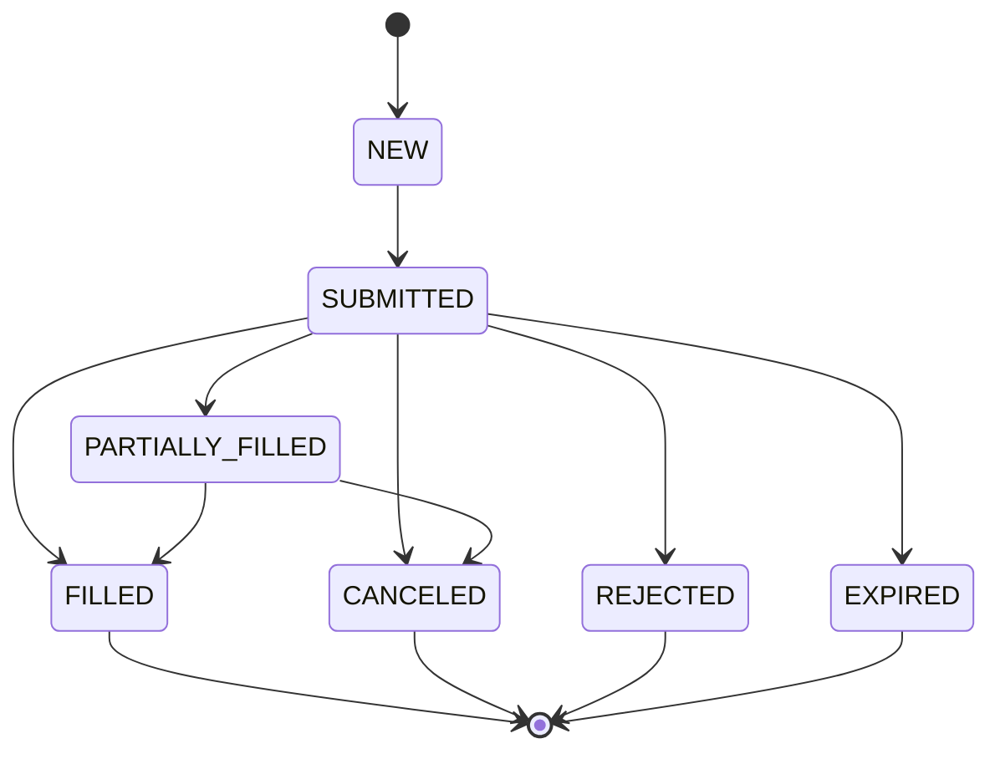
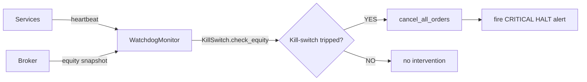
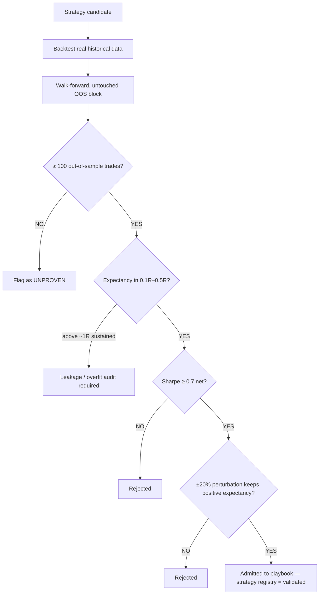
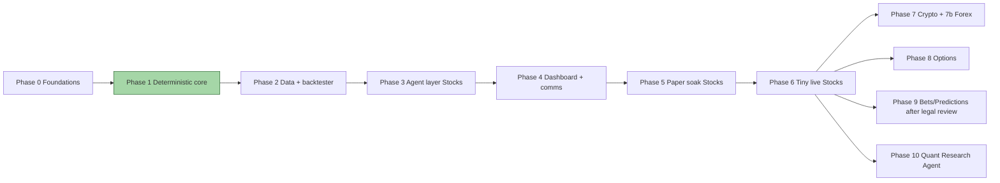

# AXEL
<<<<<<< Updated upstream
AXEL VENTURE 
=======

**Autonomous Multi-Agent Trading & Betting System** — a hierarchical agent framework that evaluates and executes trading decisions across five market sections — **Stocks, Options, Crypto, Forex, Bets/Predictions** — under a single prime overseer named *Axel*.

The full product scope is specified in [`docs/axel-v2-prd.pdf`](docs/axel-v2-prd.pdf). This README is the engineering map: what the system is, how the code is laid out, how a decision flows, and how it is kept safe.

> **Status:** Phase 0–1 scaffold built and tested. The deterministic safety layer (`axel/risk`, `axel/execution`) is **working code**; everything upstream of the risk boundary (live data ingestion, LLM agents, broker wiring) is a stub by design — nothing is trusted with capital until the deterministic core is proven.

---

## 1. Executive summary

```text
   Analysts (LLM/ML) ──► Signals ──► Expert Panel ──► Section Manager
                                                          │  Proposal
                                                          ▼
   ─────────────────── deterministic boundary ────────────────────
                                                          │
                                               Risk Package (validate → size → veto)
                                                          │  RiskDecision (APPROVED only)
                                                          ▼
                                          Approval Service (live mode, human-in-the-loop)
                                                          │
                                                      Execution Bot ──► Broker (paper/live)
                                                          │
                                                Fills ──► Reconciliation ──► DB / Dashboard
```

Three non-negotiable principles govern every design decision:

1. **Reasoning and execution are architecturally separated and CI-enforced.** Components that call an LLM may be creative or wrong with no immediate financial consequence. Components that touch capital are deterministic, auditable, hard-coded code. A build-time lint check fails CI if an LLM library is ever imported into `risk/` or `execution/`.
2. **The trust boundary is a typed database record, never a function call.** The agent side writes `Signal`, `Proposal`, `AllocationProposal` rows; the trading core reads them. There is no code path by which agent logic can directly invoke execution logic.
3. **Nothing is trusted with capital until validated *the right way for what it is*.** Deterministic rules are backtested against real historical data. LLM judgment is validated *forward*, in paper trading, with calibration tracking — never backtested against a period the model may have memorized.

---

## 2. Architecture — three trust levels



| Trust level          | Trust | Responsibilities | Credentials | Imports |
|----------------------|-------|------------------|-------------|---------|
| **Agent service**    | Untrusted / creative | Analysts, Expert Panel, Section Manager, Axel (LLM), chat. Reads data/signals, writes only `Signal`/`Proposal`/`AllocationProposal`. | **None** | LLM/ML SDKs allowed |
| **Trading core**     | Trusted / deterministic | `risk/` (validate → size → veto), `execution/` (order FSM, adapters, reconciliation, approval). | **Trade-only, withdrawal-disabled** broker keys | LLM imports **banned by CI** |
| **Watchdog**         | Trusted / independent | Kill-switch, heartbeat liveness, broker-vs-DB reconciliation. Separate process, separate DB role, separate read access. Can cancel orders and raise a global HALT the core **must** honor. | Read-only broker access | LLM imports **banned by CI** |

### 2.1 Decision flow (one trade)



> **v2 correction:** v1 described Axel as an "LLM + deterministic hybrid" that also served as the *final trade gate*. That is a contradiction — an LLM in the last gate breaks the whole reasoning/execution separation. In v2, Axel's LLM half only emits a typed `AllocationProposal`. The actual final gate is the deterministic risk package, which validates, sizes, and can **veto every proposal with zero exceptions**.

---

## 3. Repository structure

```text
axel/                      # the AXEL package
├── core/                  # shared by every process
│   ├── types.py           #   enumerations: Section, Direction, OrderSide, OrderType,
│   │                      #   TimeInForce, OrderState, ProposalStatus, RiskVerdict, TradingMode
│   ├── contracts.py       #   Signal · Proposal · RiskDecision · Order · AllocationProposal (Pydantic)
│   ├── config.py          #   AxelSettings (pydantic-settings) + double safety lock
│   ├── clock.py           #   injectable Clock / SimulatedClock (deterministic replay)
│   ├── ids.py             #   idempotent client_order_id generation
│   └── logging.py         #   structured JSON logging (one object per line)
│
├── risk/                  # DETERMINISTIC · no LLM imports (CI-enforced) · most tested code
│   ├── engine.py          #   SectionRiskAgent.evaluate() — pure, priority-ordered checks
│   ├── sizer.py           #   KellySizer — fractional Kelly, layered caps, records binding cap
│   ├── limits.py          #   RiskLimits — frozen, immutable hard-coded thresholds
│   ├── loss_manager.py    #   LossManager — 3% daily stop, ALLOW / BLOCK_NEW_ENTRIES
│   ├── allocator.py       #   CapitalAllocator — rejects >5% reallocation per cycle
│   └── killswitch.py      #   KillSwitch — 10% peak-to-trough drawdown vs high-water mark
│
├── execution/             # DETERMINISTIC · no LLM imports (CI-enforced)
│   ├── broker_base.py     #   BrokerAdapter — submit_order guarded in the base class
│   ├── alpaca.py          #   AlpacaAdapter — paper/mock by default, client_order_id idempotency
│   ├── order_fsm.py       #   OrderStateMachine — legal transitions only
│   ├── approval.py        #   ApprovalService — HITL tickets with per-section TTLs
│   └── reconcile.py       #   ReconciliationEngine — broker-vs-DB position/order drift
│
├── watchdog/              # INDEPENDENT trust level · no LLM imports (CI-enforced)
│   └── monitor.py         #   WatchdogMonitor — heartbeat + health cycle + HALT intervention
│
├── db/                    # storage
│   ├── base.py            #   DeclarativeBase + timestamp mixins
│   ├── models.py          #   16+ SQLAlchemy models (bars, signals, proposals, risk decisions,
│   │                      #   orders, fills, positions, equity snapshots, kill-switch events, audit log …)
│   └── session.py         #   engine/session factories + init_db()
│
├── agents/                # UNTRUSTED · LLM side (next build phase)
├── data/                  # providers, ingestion, backtester, validation gate (planned)
└── dashboard/             # read-only decision log / Grafana (planned)
    └── ui/                # ★ Bloomberg-style terminal dashboard (draft, zero-build static UI)

migrations/                # Alembic (schema can also be created via init_db())
scripts/
├── check_no_llm_imports.py # boundary lint — fails build on LLM imports in risk/execution
├── drive_proposals.py       # dummy-proposal driver (no LLM needed)
└── killswitch_drill.py      # Phase-1 drill: simulate 10% drawdown → HALT → cancel → verify

tests/
├── property/test_risk_properties.py   # Hypothesis — no approved order exceeds any cap
├── unit/                             # sizer, risk engine, limits, loss manager, allocator,
│                                    # kill-switch, order FSM, approval, reconciliation, contracts, clock
└── integration/test_db_models.py     # DB schema round-trips

repos/                       # cloned reference implementations (see §10)
docker-compose.yml           # TimescaleDB (Postgres 16) :5432 · Redis 7 :6379
.github/workflows/verify.yml # CI: ruff → boundary lint → pytest
```

---

## 4. Core contracts — the trust boundary

These Pydantic models are the **only** structures allowed to cross the LLM/deterministic boundary. They are frozen and strict.

| Contract | Emitted by | Meaning | Notes |
|---|---|---|---|
| `Signal` | an analyst | *Direction, strength, horizon* — analysis only | Explicitly **not** an instruction to trade |
| `Proposal` | Expert Panel / Section Manager | A concrete trade idea: symbol, side, entry, stop, target, confidence | Validation guarantees stop is on the correct side of entry |
| `RiskDecision` | **only** the risk engine | approve / reject / halt, approved qty + notional, binding limit, full check list | Unlocks execution |
| `Order` | execution layer | Executable order with a `client_order_id` | Managed by the Order FSM |
| `AllocationProposal` | Axel (overseer) | Capital shift between sections | Clamped by `CapitalAllocator` |



---

## 5. Risk management framework

The risk package is the **heart of the system**. Every trade idea must pass through `SectionRiskAgent.evaluate()` — a pure function with zero I/O and zero side effects.

### 5.1 Layered controls



### 5.2 Position sizing (Kelly)

```
f* = (b·p − q) / b          # full Kelly, p = win rate, q = 1−p, b = avg win/loss
f  = 0.25 · f*              # fractional scaling (0.25 × full Kelly)

approved size = min( 0.25·f*·C ,  0.05·C ,  (0.01·C) / stop_distance% )
                     └ fraction     └ 5%       └ 1% risk-at-stop
                     └  Kelly        └ notional └ cap from recorded stop distance
```

- If `f* ≤ 0`, size is **zero** — negative-edge trades never trade.
- A 5% haircut is applied to historical win rate before computing (overestimated edge makes Kelly dangerous, not optimal).
- Equities round down to whole shares; crypto keeps fractional precision.
- Every sizing decision **records which cap was binding** — `KELLY_FRACTION`, `NOTIONAL_CAP_5PCT`, or `RISK_AT_STOP_CAP`.

> Property test guarantee: `tests/property/test_risk_properties.py` asserts, via Hypothesis over randomized inputs, that an approved order size can **never** exceed any configured cap — the single most valuable test in the project.

### 5.3 Hard-coded limits (`RiskLimits` — frozen, immutable)

| Limit | Value | Meaning |
|---|---|---|
| `GLOBAL_MAX_DRAWDOWN` | 10% | Peak-to-trough account drawdown → trips global kill-switch |
| `SECTION_DAILY_STOP` | 3% | Per-section daily stop; blocks new entries |
| `MAX_POSITION_PCT` | 5% | Max notional exposure per trade (of section NAV) |
| `KELLY_CAP` | 25% | Fractional Kelly scaling factor |
| `MAX_PER_TRADE_RISK_PCT` | 1% | Max capital at risk at the stop distance |
| `MIN_RR_RATIO` | 1.5 | Minimum reward:risk ratio |
| `MAX_EXPECTED_R` | 4.0 | Targets above 4R flagged as likely overfitting |
| `MIN_PANEL_CONFIDENCE` | 0.30 | Below this, proposals are auto-rejected |
| `MAX_OPEN_POSITIONS_PER_SECTION` | 10 | Concurrency cap |
| `CORRELATION_BLOCK_THRESHOLD` | 0.85 | Reject if correlated with an existing position |
| `MAX_REALLOCATION_PCT_PER_CYCLE` | 5% | Max capital shifted between sections per cycle |

### 5.4 Evaluation order in `SectionRiskAgent.evaluate()`



The first fatal check short-circuits. Any failure produces a `REJECTED` verdict carrying the full list of `checks_failed` and reasons.

### 5.5 Kill-switch semantics

- **Definition:** peak-to-trough on total marked-to-market equity, measured against the running **high-water mark** — not starting capital.
- **On trigger (10% drawdown):** Watchdog sets a global HALT flag that the core **must** honor before evaluating any further proposal. State persists to `.axel_killswitch.json` so a HALT survives restarts.
- **Per-section flatten policy:**

| Section | On halt |
|---|---|
| Stocks | Cancel working orders, **hold** positions |
| Options | Cancel working orders, **hold** (early close risks assignment) |
| Crypto | Cancel working orders, **flatten** (24/7 market) |
| Forex | Cancel working orders, **hold** |
| Bets/Predictions | Cancel working orders, **hold** (illiquid to unwind early) |

- **Resume:** manual only, with a written reason logged to the append-only kill-switch events table. **No automatic resume.**

---

## 6. Execution

### 6.1 Broker abstraction

`BrokerAdapter.submit_order()` is guarded **in the base class**:

```text
if risk_decision is not APPROVED  → raise PermissionError (Execution blocked)
if qty <= 0                       → raise ValueError
```

It is structurally impossible to execute an order that was never approved by the risk engine.

- **`AlpacaAdapter`** — `mock_mode` is automatic when real credentials are missing. Real mode talks to `/v2/account`, `/v2/positions`, `/v2/orders` with `client_order_id` idempotency. `cancel_all_orders()` is the emergency flattening call used by the Watchdog on HALT. Default base URL is the **paper** endpoint.

### 6.2 Order FSM



Terminal states (`FILLED`, `CANCELED`, `EXPIRED`, `REJECTED`) have no outward transitions; self-transitions are idempotent no-ops; anything else raises `InvalidOrderTransitionError`.

### 6.3 Human-in-the-loop approvals

`ApprovalService` holds pending operator approvals with per-section TTLs (stocks 5 min, crypto 2 min, predictions 30 min, options 10 min). Tickets expire automatically and can't be approved retroactively. Only *risk-approved* decisions may enter the queue. **Live mode only** — paper trades flow automatically.

### 6.4 Reconciliation

`ReconciliationEngine` compares DB state against broker reality:
- `reconcile_positions()` — flags quantity drift per symbol.
- `reconcile_orders()` — flags **ghost orders** (on broker, not in DB) and **unmatched DB orders** (tracked but missing on broker).

---

## 7. Watchdog

An independent safety net — even if the execution bot crashed, the Watchdog can still halt the system:



---

## 8. Data, ML, and strategy validation

### 8.1 Two separate validation paths

| Path | What it validates | How |
|---|---|---|
| **Path 1 — deterministic rules** | Moving-average crossovers, carry formulas, funding-rate thresholds — code with no memory of training data | Backtest against **real historical data**, out-of-sample |
| **Path 2 — LLM panel judgment** | The Expert Panel's weighing of signals | **Forward, in paper trading only**, with calibration tracking — never backtested (the model may have memorized the period) |

### 8.2 Strategy admission to the playbook



Fixed, pre-committed thresholds (chosen *before* looking at results — thresholds chosen after seeing results are a form of overfitting).

### 8.3 Paper-to-live gate (per section)

- ≥ 8 weeks and ≥ 200 paper trades (or agreed equivalent for low-frequency sections)
- Paper expectancy and slippage within tolerance of backtest assumptions
- Zero unresolved reconciliation breaks, zero risk-rule bypass incidents, kill-switch drill passed in the last 30 days
- Recovery drill passed: kill process mid-order, restart, state reconciles
- Explicit manual sign-off — start small, per-trade human approval first

---

## 9. Sections

Every section shares the same chain — **Analysts → Expert Panel → Section risk overrides → Execution** — but differs in analysts, data, and strategies.

| Section | Edge sources | Analysts | Candidate playbook strategies (pending validation) | Venue | Special risk rules |
|---|---|---|---|---|---|
| **Stocks** | Cross-sectional momentum, low-vol anomaly, Fama–French factors | Technical, Fundamental (SEC EDGAR), Sentiment (FinGPT), Macro (FRED) | Momentum (12-1), low-beta, pairs mean-reversion | **Alpaca** | Standard caps |
| **Options** | Variance risk premium (IV > RV) | Volatility, Greeks (py-vollib/QuantLib), Sentiment, Macro | Covered calls / cash-secured puts, iron condors, calendar spreads | Alpaca | **Defined-risk structures only** until proven; tighter position cap |
| **Crypto** | Funding-rate arb on perps, cross-exchange arb, on-chain flows | Technical, On-chain, Sentiment, Funding-Rate | Funding arbitrage, cross-exchange arb, on-chain flow | Exchange APIs | **No leverage**, rolling 24h UTC stop window |
| **Forex** | Carry trade, macro-release reactions | Technical, Rate-Differential, Carry-Trade, Macro | Carry (vol-adjusted), PPP mean-reversion, release momentum | OANDA/IBKR | FX-volatility early warning |
| **Bets/Predictions** | Kalshi mispricing, sports-odds arb | Odds-Movement, News, Calibration, Line-Value | Cross-book arbitrage, near-expiry mispricing | Kalshi / books | **Gated on written legal review** |

---

## 10. Reference repositories (`repos/`)

Adaptation references from the PRD (ch. 10.3) — structural references, *not endpoints to run unmodified*:

| Repo | Role |
|---|---|
| `langchain-ai/langgraph` | Agent service orchestration / control-flow engine |
| `virattt/ai-hedge-fund` | Manager/Analyst/Risk hierarchy — structural reference |
| `TauricResearch/TradingAgents` | Expert Panel debate pattern |
| `AI4Finance-Foundation/FinRL` | ML/signal layer (deferred until a simpler baseline is beaten) |
| `AI4Finance-Foundation/FinGPT` | Sentiment Analyst sub-agent |
| `freqtrade/freqtrade` | Crypto section execution-bot reference |
| `hummingbot/hummingbot` | Market-making execution reference (later) |
| `stefan-jansen/machine-learning-for-trading` | ML-layer source material |
| `quantopian/zipline`, `stefan-jansen/zipline-reloaded`, `quant-science/sunday-quant-scientist` | Backtesting references |

---

## 11. Security, accounts & risk controls

- **Per-section accounts & keys** — each section has its own funded account and API key; no shared credentials.
- **Keys are trade-only, withdrawal-disabled** at the provider level wherever supported.
- Keys live in `.env` (never committed); only the Trading core holds them — **never** the Agent service.
- Two-factor on every account; rotate on any suspicion.
- **Paper trading is the default and required first phase** for every section.
- Live trading locks: `ENVIRONMENT=live` **and** `LIVE_TRADING_CONFIRMED=true` **and** `ALPACA_PAPER=false` — otherwise the config is invalid (`core/config.py`, double safety lock).
- Append-only tables (kill-switch events, approvals, audit log) have no UPDATE/DELETE grants for the app role.

**Environment:** copy `.env.example` → `.env`:

```bash
ENVIRONMENT=paper
ALPACA_API_KEY=PK...
ALPACA_SECRET_KEY=...
ALPACA_PAPER=true
```

---

## 12. Getting started

```bash
# 1. Python 3.11+
python -m venv .venv && source .venv/bin/activate
pip install -e '.[dev]'

# 2. Infrastructure (optional): TimescaleDB + Redis
docker compose up -d

# 3. Config
cp .env.example .env   # fill in paper keys if you have them (mock mode works without)

# 4. Verify everything
make check            # ruff → boundary lint → pytest
```

```bash
# Phase-1 drill — simulate a 10% drawdown and prove the kill-switch halts the system
.venv/bin/python scripts/killswitch_drill.py

# Drive a dummy proposal through the whole risk pipeline (no LLM needed)
.venv/bin/python scripts/drive_proposals.py

# Boundary lint — fails with exit 1 if any LLM import leaks into risk/ or execution/
.venv/bin/python scripts/check_no_llm_imports.py

# Terminal dashboard draft (simulated feed, zero build) → http://localhost:8765
python -m http.server 8765 -d axel/dashboard/ui
```

### Test suite

| Suite | What it proves |
|---|---|
| `tests/property/` | Hypothesis invariants — no approved order exceeds any cap, randomized inputs |
| `tests/unit/` | Sizer, risk engine, limits immutability, loss manager, kill-switch, order FSM, approval TTLs, reconciliation, contracts, clock |
| `tests/integration/` | DB schema round-trips |

---

## 13. Roadmap (phased build plan)

From the PRD (ch. 13) — **vertical build**: one section fully proven before the next starts. Each phase has explicit exit criteria; do not start the next until the current passes.



| Phase | Deliverables | Exit criteria |
|---|---|---|
| 0 · Foundations ✅ | Repo, Docker Compose, migrations, typed config, JSON logging, injectable clock, CI, boundary lint | Fresh clone → one command → tests green |
| 1 · Deterministic core ✅ | Contracts; risk rules/sizer/loss/allocator; order FSM; Alpaca paper adapter; reconciliation; watchdog + kill-switch; HALT alert; dummy-proposal driver — **no LLM** | Property tests pass; kill-switch drill passes; paper orders round-trip |
| 2 · Data + backtester | Point-in-time ingest (Alpaca/Polygon, FRED, EDGAR, news); backtester (fees, slippage, calendar, walk-forward); validation report; baseline strategies | Backtester reproduces a known result; deliberately overfit strategy is rejected |
| 3 · Agent layer (Stocks) | Schema-validated analysts; Expert Panel; Section Manager; Axel proposal logic; LLM budget guard; injection-resistant ingestion | 1-week paper run, zero schema violations, spend under budget |
| 4 · Dashboard + comms | Grafana on TimescaleDB; email alerts; approval flow; read-only chat | "Why did it take that trade?" answerable from the dashboard |
| 5 · Paper soak (Stocks) | Continuous paper; calibration, slippage vs backtest, incident log | Live-promotion gate met |
| 6 · Tiny live (Stocks) | Small loss-tolerable capital; manual approval per trade at first | Live ≈ paper; no risk incidents |
| 7 · Crypto / 7b · Forex | Exchange adapters, funding-rate & on-chain analysts, UTC boundaries, no leverage; OANDA/IBKR, carry analysts, FX-vol warning | Repeat Phase-5 criteria per section |
| 8 · Options | IV data, Greeks, defined-risk only, expiry/assignment handling | Pricing matches vendor Greeks; expiry drills pass |
| 9 · Bets/Predictions | **Only after written legal review** per venue; calibration-first | Legal sign-off recorded; calibration beats market-implied baseline in paper |
| 10 · Quant Research Agent | observe → propose → backtest → PR loop (one proven section first) | Human-review gate genuinely exercised |

> **Principle:** a single section proven end-to-end — real validated strategy + real paper track record — is worth more than five sections that look complete but were never tested against real data.

---

## 14. Risks & mitigations

| Risk | Mitigation |
|---|---|
| Overfitting / leakage produces fake edge | Strict validation gate, untouched OOS block, multiple-testing adjustment, LLM contamination awareness |
| Scope creep across five sections | Vertical slice; explicit phase exit criteria; later sections reuse the proven core |
| Runaway LLM cost | Budget guard, event-driven triggers, model tiering |
| Silent failure (stale data, drift) | Reconciliation, heartbeats, fail-closed defaults |
| LLM-driven bad trade | LLM cannot reach execution (CI-enforced); deterministic veto; per-trade risk cap; human approval in live |
| Legal issues on venues | Confirm per venue before building; paper trading first |

---

## 15. More documentation

| Doc | Contents |
|---|---|
| `docs/axel-v2-prd.pdf` | **The full product specification (ch. 1–16)** — supersedes v1; scope, corrections, and build plan |
| `phases/how-the-app-works.md` | Deep code walkthrough of the implemented system |
| `phases/run-and-debug.md` | Operator runbook |
| `docs/run-paper-data-and-agents.md` | Running data providers + agent service in paper mode |
| `docs/phase-0-1-audit-and-phase-3-4-plan.md` | Audit of what's built + plan for agent/dashboard phases |

---

## Disclaimer

This project is **software engineering structure only**. It is not financial or legal advice. The financial projection in the PRD (ch. 9) is a hypothetical model built on stated, unproven assumptions. **Automated trading can lose money even when validated.** No strategy is trusted with capital until it has been validated per the methodology in §8. Use at your own risk.
>>>>>>> Stashed changes
