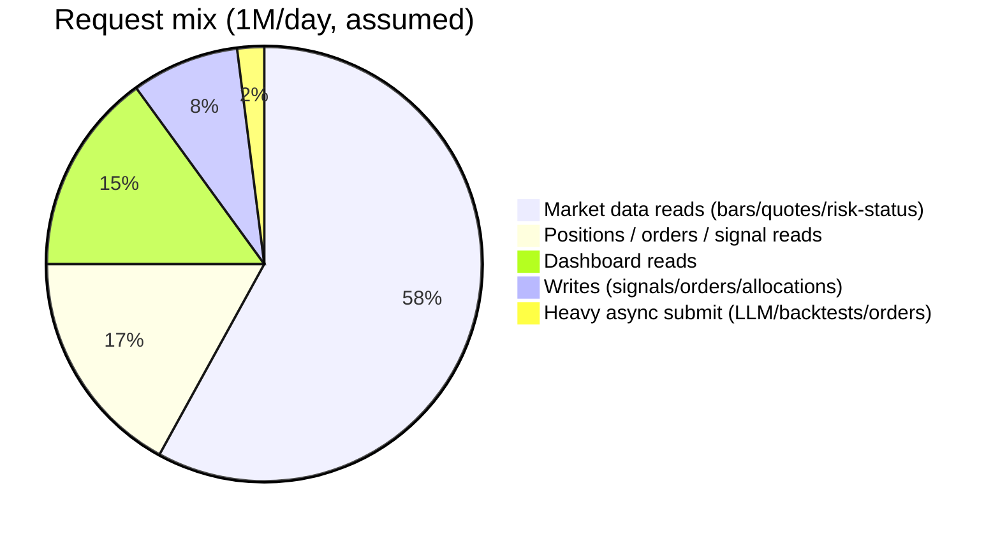
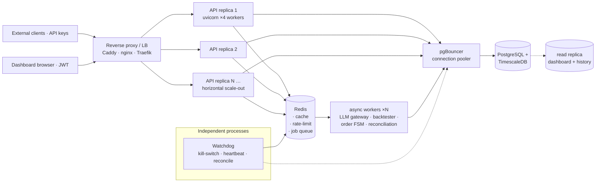
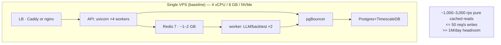
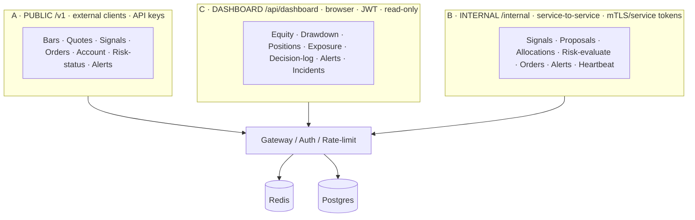
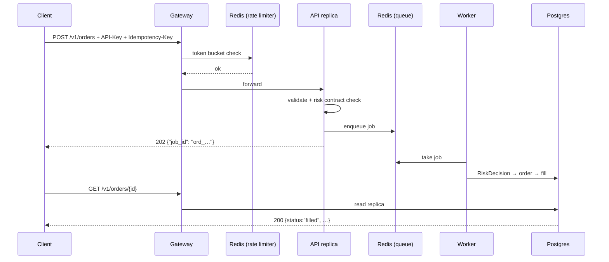

# AXEL — API Endpoints & Scaling Design

**Target:** ~1,000,000 requests/day · mixed workload (hot reads + heavy async jobs) · Docker on a small VPS
**Baseline check:** 1M/day ≈ **12 req/s average**, realistically **50–200 req/s peak**. That is *small* in HTTP terms — a single 4 vCPU/8 GB box serves it. The design below scales horizontally for bursts and zero-downtime deploys, not because 1M/day is heavy.

---

## 1. Traffic model



| Metric | Value |
|---|---|
| Total requests / day | 1,000,000 |
| Average sustained rps | ~11.6 |
| Peak rps (market open, event spikes) | 50–200 |
| Share of slow async jobs (LLM, backtests, order exec) | ~2% (≈20k ops/day) |
| Read:write ratio | ≈ 11 : 1 |
| P95 latency target — cached reads | < 50 ms |
| P95 latency target — async submit (202 + poll) | job-driven (seconds–minutes) |

**Key insight:** the 2% of requests that are *slow* (LLM analysis, backtests, order submission) are what would destroy an API that blocks on them. Everything else is cacheable. The architecture therefore separates **sync reads** from **async jobs** — hard line, no exceptions.

---

## 2. Overarching scaling architecture



### Scaling rules (non-negotiable)

| # | Rule | Why |
|---|---|---|
| 1 | **API replicas stay stateless.** No in-memory session/state; shared state lives in Redis/Postgres. | Scale-out = add replicas behind the LB. No sticky sessions, no affinity. |
| 2 | **Slow work is queued, never awaited.** LLM calls, backtests, order submission → `202 Accepted` + job id. | The 2% heavy share otherwise caps throughput at ~dozens/s and tanks p95. |
| 3 | **Hot reads are cached in Redis** (short TTL 2–5 s, or pub/sub invalidation). | The 58% market-data share becomes near-memory-speed; DB load collapses. |
| 4 | **Connection pool behind every DB access** (pgbouncer, app-side limits). | 12 rps never kills Postgres; *connection churn* does. Pool fixes the real killer. |
| 5 | **Rate limit per API key** at the LB and again in-app (Redis token bucket → `429`). | Protects the VPS from a single key's bursts; enables per-tier quotas. |
| 6 | **Read replicas absorb analysis/analytics reads** (dashboard, history, joins). | Keeps the primary write path (orders, risk decisions) fast and isolated. |

---

## 3. Capacity plan on a VPS



| Tier | Requests/day supported | Setup |
|---|---|---|
| **Single VPS (baseline)** | 1M–5M | 1 box: LB + API(×4) + Redis + Postgres + 2 workers |
| **Horizontal scale-out** | 5M–30M | More API replicas; workers as a separate pool; then read replica |
| **Full HA / regional** | 30M+ | Managed Postgres, multi-API clusters, Redis Sentinel/Cluster |

---

## 4. Endpoint surface — three trust-scoped groups

Endpoints are split by *caller*, mirroring the PRD's three trust levels, so the HTTP layer preserves the safety boundary:



### 4.A Public API — `/v1/*` (API-key auth, trade-only keys, idempotency on writes)

| Method | Path | Purpose | Hot-read? | Cache / scaling |
|---|---|---|---|---|
| `GET` | `/v1/account` | account, equity, margins | low | Redis 10 s |
| `GET` | `/v1/positions` | open positions | medium | Redis 2 s |
| `GET` | `/v1/bars/{symbol}?from=&to=&frame=` | OHLCV bars | **high** | Redis + read replica |
| `GET` | `/v1/quotes/{symbol}` | live quote | **high** | Redis 2 s |
| `GET` | `/v1/signals?section=&symbol=` | analyst signals | medium | read replica, paginated |
| `POST` | `/v1/signals` | submit an external signal | low | 202 + async validate |
| `GET` | `/v1/orders?status=&cursor=` | order history | medium | read replica, cursor-paginated |
| `POST` | `/v1/orders` | submit an order | low | **202 + queue** · `Idempotency-Key` required |
| `GET` | `/v1/orders/{id}` | order status | medium | read replica |
| `GET` | `/v1/risk/limits` | current hard limits | low | Redis 60 s |
| `GET` | `/v1/risk/status` | kill-switch / HALT state | **high** (pollers) | Redis 2 s |
| `GET` | `/v1/alerts?after_cursor=` | alert stream | medium | read replica |

**Public write contract (async, idempotent):**

```
POST /v1/orders
Idempotency-Key: 9a4f7d…
Content-Type: application/json
{ "section": "stocks", "symbol": "AAPL",
  "side": "buy", "qty": 12, "order_type": "limit", "limit_price": 225.10 }

→ 202 Accepted
{ "job_id": "ord_…", "status": "queued" }

GET /v1/orders/{id}            # client polls, or subscribes via webhook
→ {
    "status": "pending_approval",     # HITL gate (live mode only)
    "risk": { "verdict": "approved", "binding_cap": "RISK_AT_STOP_CAP", "qty": 12 }
  }
→ { "status": "filled", "filled_qty": 12, "avg_price": 225.05 }
→ { "status": "rejected", "reasons": ["EXPECTANCY_BELOW_THRESHOLD"] }
→ { "status": "halted", "reason": "AXEL HALT: 10% drawdown" }
```

### 4.B Internal service API — `/internal/*` (never exposed publicly; mTLS/service token)

| Method | Path | From → To | Purpose | Sketch |
|---|---|---|---|---|
| `POST` | `/internal/signals` | agent svc → core | persist validated `Signal` | row in `signals` |
| `POST` | `/internal/proposals` | agent svc → core | persist `Proposal` — **LLM side ends here** | row in `trade_proposals` |
| `POST` | `/internal/allocations` | Axel oversight → core | persist `AllocationProposal` | validated+clamped by allocator |
| `GET` | `/internal/risk/evaluate/{proposal_id}` | core → core | run `SectionRiskAgent.evaluate()` off the row | `RiskDecision` written |
| `POST` | `/internal/orders` | core → execution | enqueue approved order for execution | order FSM + broker |
| `POST` | `/internal/alerts` | watchdog/core → comms | HALT + critical alerts | append-only feed |
| `POST` | `/internal/heartbeat` | services → watchdog | liveness | Redis key + TTL |

> **Boundary note (PRD ch. 2).** The "real" trust boundary is a *typed DB record*, not these HTTP calls — this internal surface is a thin transport over the same `Signal`/`Proposal`/`AllocationProposal`/`RiskDecision` contracts, so the CI lint (no LLM imports in `risk/`, `execution/`) and the guarded `submit_order` in `broker_base.py` remain the true guards.

### 4.C Dashboard / BFF — `/api/dashboard/*` (JWT, read-only, read replica)

| Method | Path | Purpose | Rendering |
|---|---|---|---|
| `GET` | `/api/dashboard/equity?bucket=1h` | equity curve | line chart |
| `GET` | `/api/dashboard/drawdown` | high-water mark + current DD | area chart |
| `GET` | `/api/dashboard/positions` | live positions | table |
| `GET` | `/api/dashboard/section-exposure` | per-section exposure | pie / treemap |
| `GET` | `/api/dashboard/decision-log?limit=` | proposal → risk → order trail | table (`axel/dashboard/decision_log.py`) |
| `GET` | `/api/dashboard/alerts` | recent alert feed | feed |
| `GET` | `/api/dashboard/incidents` | paper-soak incidents + promotion-gate status | cards |

Time-bucketed aggregate endpoints (`quantity=max/min/first/last`) so the browser never pulls raw hypertable rows.

---

## 5. Authn / Authz matrix

| Caller | Authentication | Authorization | Rate limit |
|---|---|---|---|
| External client | API key (`X-API-Key`) | trade-only, withdrawal-disabled, per-section scopes | Redis token bucket, per key |
| Dashboard browser | JWT (short-lived) + refresh | read-only role | per user |
| Internal services | mTLS cert or service token | role-based (agent/core/watchdog) | generous internal quota |
| Watchdog | service token | read + `halt`-capable only | — |



---

## 6. Caching strategy

| Data | Cache | TTL | Invalidation |
|---|---|---|---|
| Bars / quotes | Redis | 2–5 s | None (time-bound) |
| Risk status / limits | Redis | 2–60 s | pub/sub on kill-switch trip |
| Account / positions | Redis | 2–10 s | on order event post-execution |
| Dashboard aggregates | Redis | 30 s | — |
| Signals list | read replica | — | — |
| External order submits | Redis idempotency store | 24 h | key = `Idempotency-Key` |

---

## 7. Database & queue sizing

| Component | Sizing rationale |
|---|---|
| **PostgreSQL + TimescaleDB** | System of record. Hypertables for `bars`, `signals`, `equity_snapshots`; append-only grants for kill-switch/approvals/audit. |
| **pgBouncer** | Caps connections (e.g. 60–100) so 4 uvicorn × N replicas never exhaust Postgres. |
| **Read replica** | Dashboard + history/analytics joins. Async logical replication. |
| **Redis 7** | Cache + token-bucket rate-limit + job queue (list) + pub/sub alerts + idempotency keys. ~1–2 GB on baseline. |
| **Async workers** | 2–4 consumers; horizontal when LLM/backtest load grows. Backpressure via queue depth metric. |
| **Watchdog** | Separate process + DB role + broker read access; HALT propagated via Redis pub/sub + DB flag. |

---

## 8. Failure modes & fail-closed behavior

| Scenario | Behavior |
|---|---|
| Redis down | Reads fall back to Postgres; rate-limit fails *open* (log + warn); queue pauses (no new jobs). |
| Postgres primary down | No writes (orders/risk decisions halt). Read replica serves dashboard. **Fail closed on anything financial.** |
| Queue backpressure | New async submits → `503` (or `429`); already "queued" jobs retained. |
| Watchdog HALT | Redis pub/sub + DB flag; all replicas see HALT ≤ 1 s; new proposals blocked at risk layer. |
| API replica crash | LB health-check drops it; stateless ⇒ instant restart. |
| LLM provider timeout | Worker retries with backoff; spend guard (`LlmBudgetGuard`) unchanged. |

---

## 9. Repo changes to implement this

```text
pyproject.toml        # + fastapi, uvicorn[standard], redis (or arq), slowapi/py-rate, httpx (already present)
axel/api/
├── __init__.py
├── middleware.py      # auth, rate-limit (token bucket), idempotency (Redis)
├── public.py          # /v1/*   — bars, quotes, signals, orders, risk, alerts
├── internal.py        # /internal/* — signals, proposals, allocations, risk-evaluate, orders, heartbeat
├── dashboard.py       # /api/dashboard/* — read-only BFF on read replica
├── worker.py          # async job consumer: LLM gateway / backtester / order FSM
└── repositories.py    # typed reads/writes over the existing contracts (no business logic)
docker-compose.yml     # + redis service, + caddy/nginx LB, + worker service
migrations/            # hypertables + read-replica grants (TimescaleDB)
tests/api/             # unit: auth, rate-limit, idempotency, 202/async contract; contract: revert-safe
```

- The API layer **only reads/writes the existing typed contracts** — it adds no path around `SectionRiskAgent.evaluate()` or the guarded `submit_order`.
- CI keeps `risk/` + `execution/` free of LLM imports; the new `axel/api/` is neutral transport.
- The 45-test suite stays green (new `tests/api/` added alongside).

---

## 10. Expected performance summary

| Workload type | Path | Latency | Throughput on baseline VPS |
|---|---|---|---|
| Cached read (quote/bars/risk-status) | Redis | < 5–10 ms | 1,000–3,000 rps |
| Uncached read (history/orders) | read replica | 20–80 ms | 300–1,000 rps |
| Write (signal/order/alert) | Postgres primary | 5–30 ms | ≤ 50 rps (replicas scale via queue) |
| Async job (LLM/backtest/order) | queue + worker | 202 immediate; job 1 s–10 min | horizontal worker pool |

**Bottom line:** 1M req/day = ~12 rps average. A single 4 vCPU VPS running FastAPI + Redis + Postgres + a small worker pool clears it ~10× over. The horizontal layer (LB + stateless replicas + queues + read replica) exists for **bursts, HA, and growing beyond ~5M/day** — it is cheap to build now and removes the ceiling later.